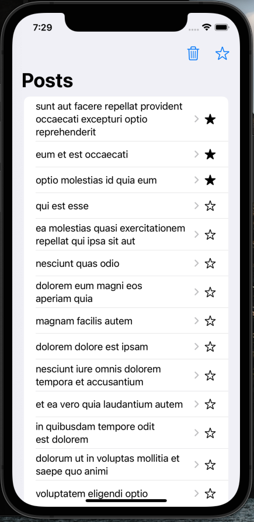

# JSON-placeholder-ios

Technical test made by Paolo Torregrosa (*Paolinsky*)

## Setup

You need cocoapods.

```
pod install
```

Open JSON-placeholder-ios.xcworkspace in XCode (Not .xcodeproj)

Run the app.

## Observations

- I used only one third part library, Alamofire for HTTP requests
- I used MVVM as my structural guide for the project

I used MVVM in this application cause I think using VIPER can be overkill. MVVM gives me the perfect structural guide for an application of this size, I would use viper if the app was bigger and more propense to big changes.

Alamofire turns out to be one of the easiest options to use and configure, only for that reason I decided to use this library.

## Considerations

I do not have a lot of experience with UI testing in iOS, that is the reason I only did normal unit testing for my utils. I researched about it and I find that UI testing with XCTest is very similar to web UI testing using seleniumm or similar tools.

I used the MVVM pattern instead of VIPER, I have more experience building from scratch with it.

I really like the native look and UX of iOS, that is the reason why I deviated from the original mock.

Thinks that I would like to improve:
 - The UI of the post description
 - The amount of service requests
 - UI Testing
 - I am interested in performance testing
 - Mock the back-end for testing and offline development
 - Some parts of the code become a little bit repetitive, a review and refactor of the code in the view models and utils can be good.
 - An animated launch screen

## Captures




